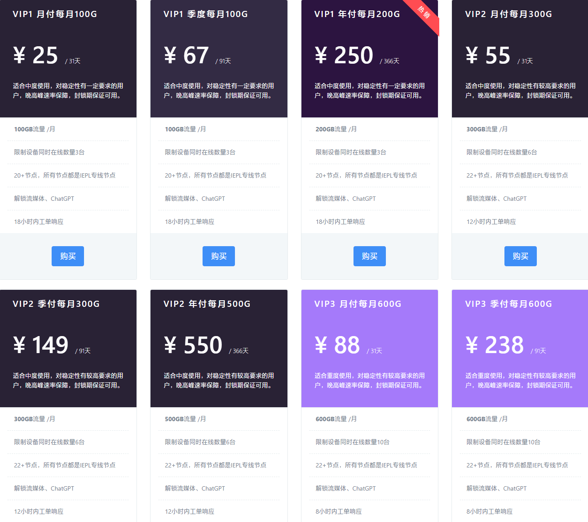

# Web3加速器(web3jsq)官网地址

永久官网：[web3jsq.com](https://web3jsq.com/f/zO44zE0O)

## Web3加速器(web3jsq)简介

Web3加速器(web3jsq)，全球节点，稳定不掉线。全IPLC专线服务，4K视频秒开。不记录日志，匿名稳定。可钱包登录、usdt支付。

在全球超过20条优质线路，节点包括亚洲、美洲和欧洲等国家地区，如中国香港、中国台湾、日本、新加坡、韩国、美国和英国等，支持看奈飞Netflix/HULU/HBO/TVB等流媒体视频，性价比很高。

## Web3加速器(web3jsq)优惠码

目前暂无优惠活动。

## Web3加速器(web3jsq)特点

* 4K秒开秒拖，Youtube视频随意拖动。看推、刷剧、科研、学习统统支持。
* 完全匿名，不记录任何日志，支持MetaMask登录，可虚拟货币支付。
* 全IPLC专线开辟的专用节点，拥有超过20个优质线路节点，确保稳定。
* 针对Web3进行优化。无设备数量限制，不限速，理论上可无限多人同时使用。
* 国际Global Accelerator专线加速网络，全节点SLA保障。
* 服务器部署在全球各地，中转线路包括香港/台湾/日本/美国/加拿大/欧洲/新加坡/韩国等。
* 支持解锁ChatGPT 以及 Netflix、Hulu、HBO、YouTube Premium、Disney Plus等流媒体。
* 老牌平价稳定网络解锁服务。

## Web3加速器(web3jsq)套餐价格

￥25/月/100G流量起，年付价格更优惠。

>vip1:100G/月 |25/月，67/季
> 
>vip1:200G/月| 250/年
> 
>vip2:300G/月| 55/月，149/季
> 
>vip2:500G/月| 550/年
> 
>vip3:600G/月| 88/月，238/季
> 
>vip3:800G/月| 880/年

详细套餐介绍参考下图表：

